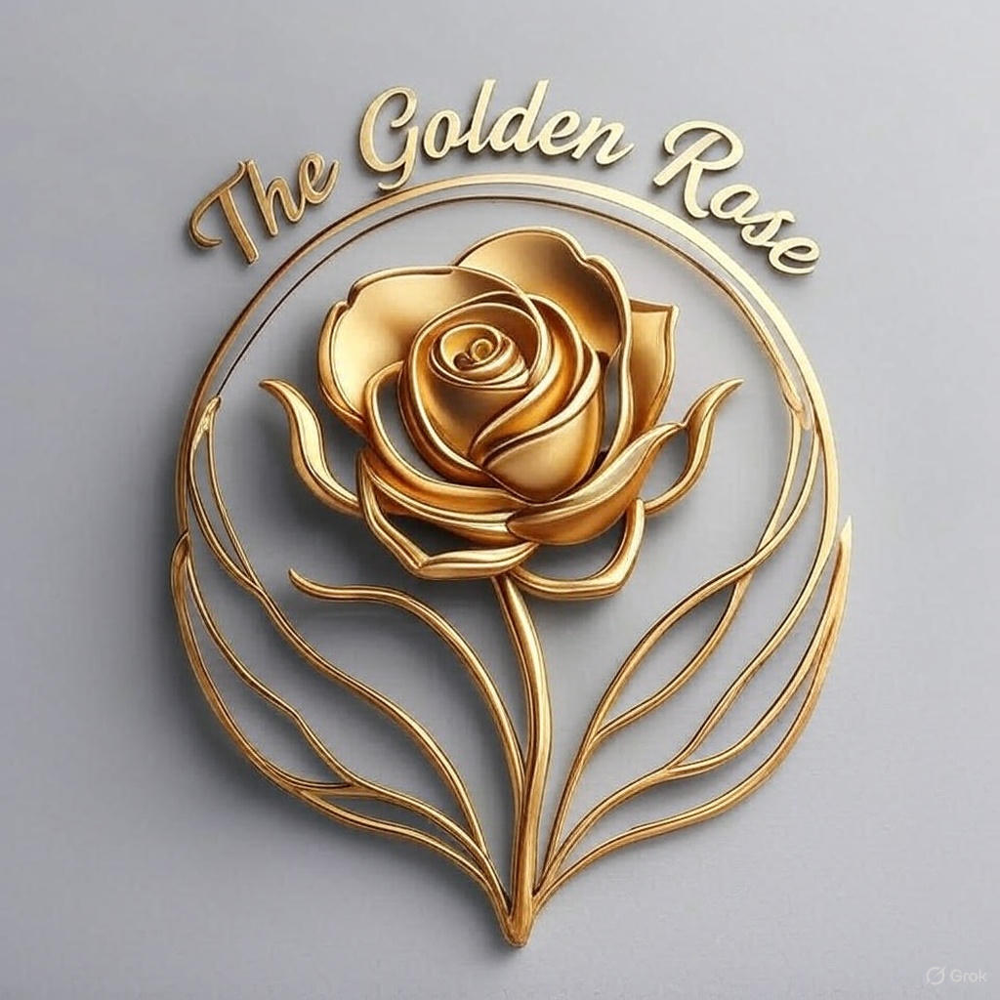

# 🌹 The Golden Rose - Modern Takeaway Website

A beautiful, fully responsive React + Tailwind CSS website for The Golden Rose, a UK-based takeaway and mini-store in Newhaven, East Sussex.



## 🌟 Live Demo

Visit the live website: [Add your deployed URL here]

## 📋 About

The Golden Rose was created to honour Rosemary Jennings' (1952-2022) dream of opening a café. This website showcases our products, tells our story, and makes it easy for customers to connect with us.

## ✨ Features

### 🏠 Home Page
- Eye-catching hero section with live status indicator
- Video showcase of our store
- Featured products with ratings
- Customer testimonials
- Membership program (£2.99/month for 10% off)
- Special offers with countdown timer
- How it works section

### 📱 Products/Menu Page
- Search functionality
- Category filtering (7 categories)
- 10 products with images and prices
- Star ratings
- Responsive grid layout

### 📖 About Page
- Heartfelt story of Rosemary Jennings
- Family legacy and values
- Timeline from 1952 to present
- Virtual store tour video
- Restaurant images

### 📞 Contact Page
- Contact form
- Google Maps integration
- Business information
- Opening hours
- Social media links

### 💎 Membership Program
- £2.99/month subscription
- 10% discount on all products
- Includes price marked items
- Prominent CTAs throughout site

## 🛠️ Tech Stack

- **React 18.2.0** - UI framework
- **React Router DOM 6.22.0** - Client-side routing
- **Tailwind CSS 3.4.1** - Utility-first CSS framework
- **Vite 5.1.0** - Build tool and dev server
- **PostCSS & Autoprefixer** - CSS processing

## 🚀 Getting Started

### Prerequisites

- Node.js 16+ 
- npm or yarn

### Installation

1. Clone the repository
```bash
git clone https://github.com/yourusername/the-golden-rose.git
cd the-golden-rose
```

2. Install dependencies
```bash
npm install
```

3. Start the development server
```bash
npm run dev
```

4. Open your browser and visit `http://localhost:5173`

### Build for Production

```bash
npm run build
```

The production files will be in the `dist/` folder.

### Preview Production Build

```bash
npm run preview
```

## 📁 Project Structure

```
the-golden-rose/
├── assets/              # Images, logo, and video
├── src/
│   ├── components/      # Reusable components
│   │   ├── Navbar.jsx
│   │   ├── Footer.jsx
│   │   └── ProductCard.jsx
│   ├── data/           # Product data
│   │   └── products.js
│   ├── pages/          # Page components
│   │   ├── Home.jsx
│   │   ├── Products.jsx
│   │   ├── About.jsx
│   │   └── Contact.jsx
│   ├── App.jsx
│   ├── main.jsx
│   └── index.css
├── .kiro/              # AI steering documents
├── index.html
├── package.json
├── tailwind.config.js
└── vite.config.js
```

## 🎨 Design Features

- **Color Scheme**: Warm orange-red gradients with yellow accents
- **Typography**: Modern, bold headings with clear hierarchy
- **Animations**: Smooth transitions, hover effects, pulse animations
- **Responsive**: Mobile-first design (1-4 column grids)
- **Interactive**: Hover effects on all buttons, cards, and images

## 📦 Products

10 products across 7 categories:
- Drinks (Vimto)
- Groceries (Branston Beans)
- Dairy (Lakeland Butter)
- Confectionery (Maltesers, Cadbury Creme Egg)
- Baking (Flour, Sugar)
- Pet Food (Whiskas)
- Frozen (Strawberry Cones)

## 📞 Contact Information

- **Address**: 8 High St, Newhaven BN9 9PE, UK
- **Phone**: +44 7396 890670
- **Email**: thegoldenrose1952@gmail.com
- **Facebook**: [The Golden Rose](https://www.facebook.com/share/1SKshnZnyy/)

## 🌐 Deployment

### Netlify

[](https://app.netlify.com/start/deploy)

### Vercel

[](https://vercel.com/new/clone)

### Manual Deployment

1. Build the project: `npm run build`
2. Upload the `dist/` folder to your hosting provider
3. Configure your domain

## 📝 Environment Variables

No environment variables required for basic functionality.

## 🤝 Contributing

This is a private business website. For inquiries, please contact thegoldenrose1952@gmail.com

## 📄 License

© 2024 The Golden Rose. All rights reserved.

## 🙏 Acknowledgments

- Built with React and Tailwind CSS
- Developed with Vite
- In loving memory of Rosemary Jennings (1952-2022)

## 📸 Screenshots

### Home Page


### Products Page


### About Page


---

**Made with ❤️ for The Golden Rose**
